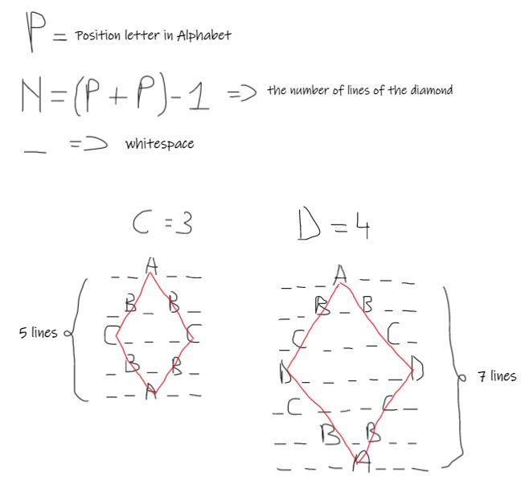

## Print Diamond

### The `buildDiamond` function can print a diamond with a character from the alphabet.

```javascript
import buildDiamond from './diamond'

buildDiamond('B')
// output
[
  " A ",
  "B B",
  " A ",
]


buildDiamond('C')
// output
[
  "  A  ",
  " B B ",
  "C   C",
  " B B ",
  "  A  ",
]
```

**Usage:**

- `clone this repository`
- `npm install`
- `npm test`


